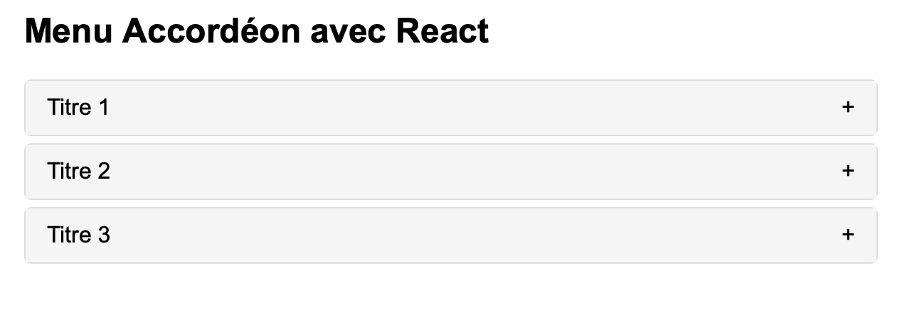

# React-Accordion

Le React-Accordion est un composant simple, léger et facilement personnalisable pour afficher des contenus cachés dans un format d'accordéon. Grâce à react-spring, ce composant offre une animation fluide lors de l'ouverture et de la fermeture.



## Fonctionnalités

- Simplicité: Intégrez-le facilement dans n'importe quelle application React.
- Animation fluide: Animé avec react-spring pour un effet doux lors de l'ouverture et de la fermeture.
- Personnalisable: Modifiez les styles selon vos besoins.

## Comment l'utiliser ?

1. Clonez le repo.
2. dans le terminal tu projet entrez ```npm start```

## Personnalisation

- Modifiez Accordion.css pour adapter le style à vos préférences. Vous pouvez ajuster les couleurs, les bordures, le padding et plus encore.
- Si vous souhaitez personnaliser l'animation, ajustez les propriétés dans le hook useSpring dans Accordion.js.

## Contribution

Si vous avez des suggestions ou des améliorations, n'hésitez pas à ouvrir une issue ou à soumettre une pull request. Toutes les contributions sont les bienvenues!